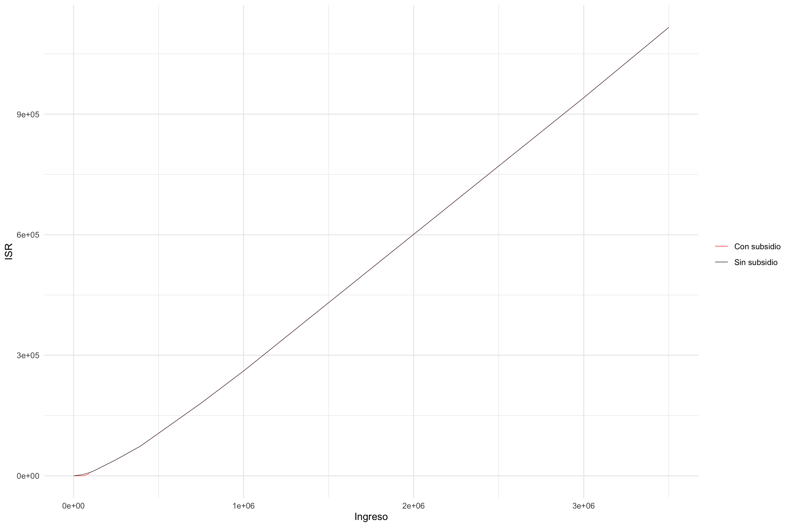
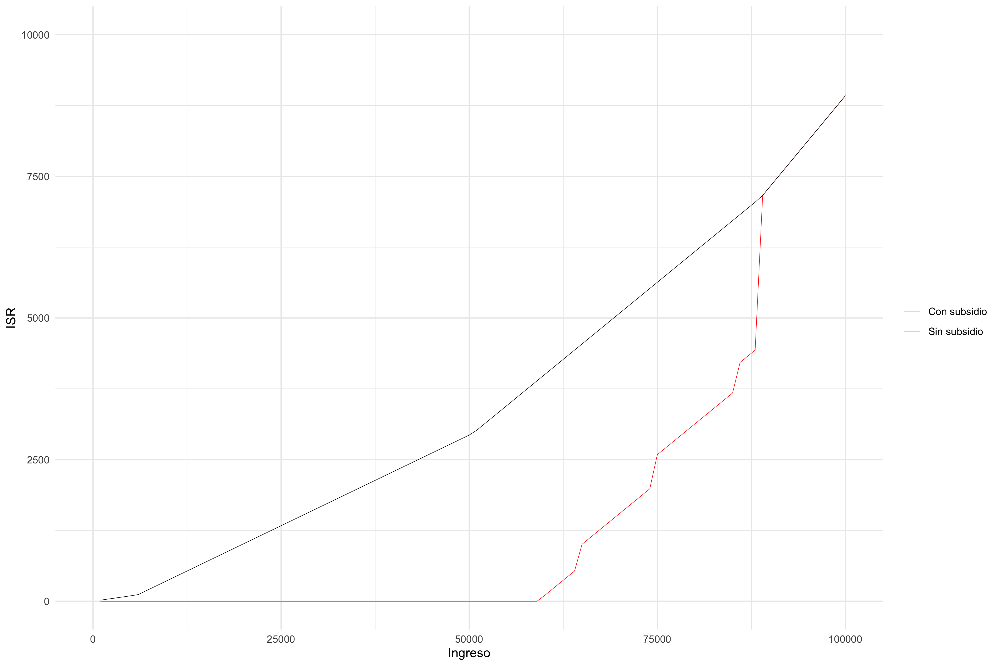
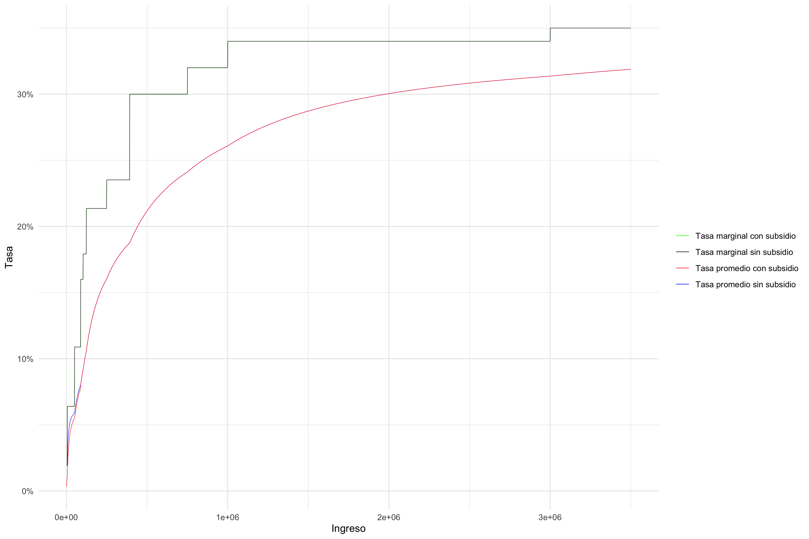
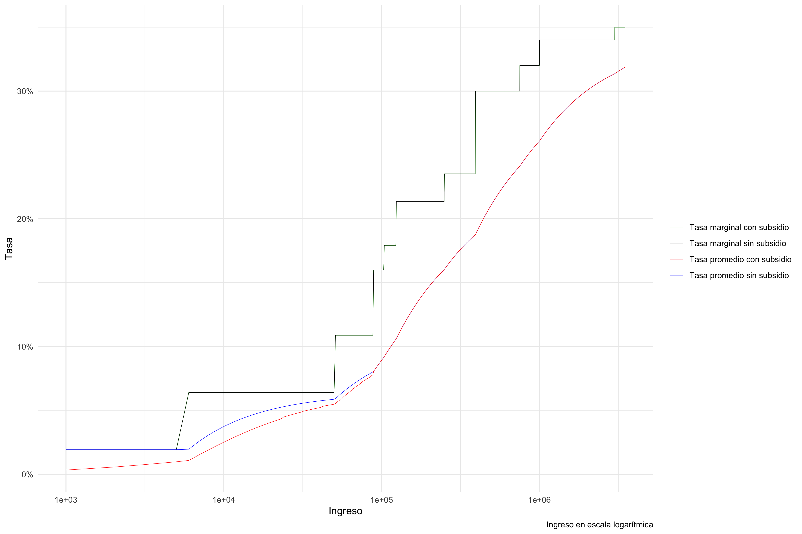

# Tarea

## Finanzas Públicas

###### Instituto Tecnológico Autónomo de México

###### Carlos Lezama

### ISR e IVA

A continuación, se muestran simulaciones de recaudación e ingresos de acuerdo al **impuesto sobre la renta** (ISR) y el **subsidio para el empleo** con base en los artículos 152 y décimo transitorio de la **Ley del Impuesto sobre la Renta**.

Para ilustrarlo, se consideró una secuencia de ingresos entre $\$ 0$ y $\$3,500,000$ con incrementos de $\$1,000$.

